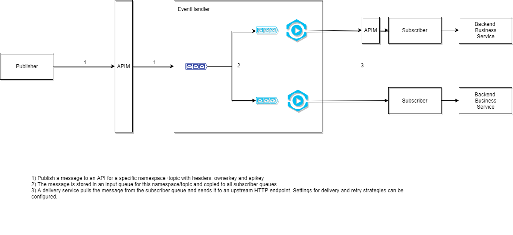

# EventHandler

<!-- START doctoc generated TOC please keep comment here to allow auto update -->
<!-- DON'T EDIT THIS SECTION, INSTEAD RE-RUN doctoc TO UPDATE -->


- [Document historiek](#document-historiek)
- [Introductie](#introductie)
- [Links](#links)
- [Publish](#publish)
  - [Create namespace](#create-namespace)
  - [Create topic](#create-topic)
  - [Packages](#packages)
  - [Omgaan met onbeschikbaarheden](#omgaan-met-onbeschikbaarheden)
- [Subscribe](#subscribe)
  - [Create subscription](#create-subscription)
    - [Topic subscription](#topic-subscription)
    - [Wildcard subscription](#wildcard-subscription)
  - [Volgorde van berichten](#volgorde-van-berichten)
  - [Retries strategies](#retries-strategies)
    - [First level: Success](#first-level-success)
    - [First level: Delete](#first-level-delete)
    - [First level: Error Queue](#first-level-error-queue)
    - [First level: Stop](#first-level-stop)
    - [Second level: Success, error, delete](#second-level-success-error-delete)
- [Voorbeeld](#voorbeeld)

<!-- END doctoc generated TOC please keep comment here to allow auto update -->

# Document historiek

Versie   | Auteur                 | Datum      | Opmerkingen
------   | -------                | -----      | ------------
1        | Dries Droesbeke | 04/04/2018 | Initial draft.

# Introductie

De eventhandler is een ACPAAS component die gebruikt wordt om berichten te publiceren waarop verschillende afnemers kunnen subscriben. 

De eventhandler is een abstractielaag voor pub/sub dat momenteel gebruik maakt van RabbitMQ en MongoDB en volledig werkt op basis van http voor het versturen van de berichten.

Het verschil met "traditionele pub/sub" systemen is dat de eventhandler de berichten pusht over http.




# Links

| Environment        | Eventhandler UI           | Permissions  | API 
| --- | --- | --- | ---
| DEV     | https://eventhandler-o.antwerpen.be| https://um-a.antwerpen.be | https://api-store-o.antwerpen.be/#/org/acpaas/api/eventhandler/v2/documentation
| ACC      | https://eventhandler-a.antwerpen.be      |   https://um-a.antwerpen.be | https://api-store-a.antwerpen.be/#/org/acpaas/api/eventhandler/v2/documentation
| PROD | https://eventhandler.antwerpen.be      |  https://eventhandler.antwerpen.be | https://api-store.antwerpen.be/#/org/acpaas/api/eventhandler/v2/documentation

# Publish

In de EventHandler UI of via de admin API kan je voor de berichten die je wil publishen een namespace(project) en topics(type berichten) aanmaken.

## Create namespace


## Create topic


## Packages
**NodeJS**
* https://bitbucket.antwerpen.be/projects/NPM/repos/digipolis-event_npm_nodejs/browse

**dotnet**
* https://github.com/digipolisantwerp/dataaccess-eventhandler_aspnetcore
* https://github.com/digipolisantwerp/eventhandler_aspnetcore
https://www.hangfire.io


## Omgaan met onbeschikbaarheden

Hoewel de EventHandler high available is opgezet kan je ervan uitgaan dat deze (net zoals iedere andere dependency) op een gegeven moment niet beschikbaar zal zijn voor uw applicatie.

Hierdoor raden we aan om ook met een interne queue/tabel te werken binnen de applicatie zodat er geen inconsistenties ontstaan tussen de data uit de verschillende systemen.


# Subscribe

## Create subscription


Voor iedere subscription kan je onderstaande zaken instellen:
* naam
* endpoint
* authenticatie
    * none
    * basic auth
    * apikey
    * OAuth2 client_credentials
* aantal berichten dat gelijktijdig verzonden mogen worden
* retry strategie
    * first level
    * second level


### Topic subscription

Met een topic subscription krijg je alle berichten binnen voor deze specifieke topic.

### Wildcard subscription

Met een wildcard subscription kan je subscriben op meerdere topics.

Volgende wildcard karakters zijn beschikbaar:

* "*": kan exact 1 woord vervangen
* "#": kan 0 of meerdere woorden vervangen

Bijvoorbeeld voor topic "{bedrijf}.{entiteit}.{event}" 
* digipolis.medewerker.created
* digipolis.medewerker.updated
* digipolis.applicatie.created
* digipolis.applicatie.updated

| subscription        | matches           | 
| --- | --- |
| digipolis.*.created     | digipolis.medewerker.created digipolis.applicatie.created
| #.updated     | digipolis.medewerker.updated digipolis.applicatie.updated

Alle matches komen sequentieel op 1 queue terecht voor de subscriber en zullen volgens de configuratie van de subscription verwerkt worden.

## Volgorde van berichten

Als het belangrijk is om de volgorde te respecteren bij het afleveren van de berichten kan je gebruik maken van EventHandler functionaleit of dit in de subscriber zelf verwerken.

Via de **EventHandler** kan je dit bekomen door de subscription te configureren om maximum 1 bericht parallel door te sturen en de subscription te stoppen als er 1 bericht faalt. Afhankelijk van throughput van de subscriber kan dit al snel een bottleneck worden. De EventHandler past het principe van "best effort" naar volgorde toe. Dit wil zeggen dat er onder uitzonderlijke omstandigheden(failover) 2 berichten tegelijk gestuurd kunnen worden en de volgorde dus verloren gaat.

Een andere optie is om in het bericht zelf een "sequenceId" of "timeStamp" te voorzien en alle berichten in een queue/tabel van de subscriber te persisteren. Daarna kan er dan een ander proces de berichten sorteren en verwerken.

## Retries strategies

### First level: Success


```json

```

### First level: Delete


```json
{
  "config": {
    "retries": {
      "firstLevelRetries": {
        "enabled": true,
        "retries": 3,
        "onFailure": "delete"
      }
    }
  }
}
```

### First level: Error Queue


```json
{
  "config": {
    "retries": {
      "firstLevelRetries": {
        "enabled": true,
        "retries": 3,
        "onFailure": "error"
      }
    }
  }
}
```

### First level: Stop


```json
{
  "config": {
    "retries": {
      "firstLevelRetries": {
        "enabled": true,
        "retries": 3,
        "onFailure": "stop"
      },
      "restartAfterStop": {
        "delayInMinutes": 30,
        "enabled": true
      }
    }
  }
}
```

### Second level: Success, error, delete


```json
{
  "config": {
    "retries": {
      "firstLevelRetries": {
        "enabled": true,
        "retries": 3,
        "onFailure": "second"
      },
      "secondLevelRetries": {
        "enabled": true,
        "retries": 5,
        "ttl": 600,
        "onFailure": "error"
      }
    }
  }
}
```

# Voorbeeld
In dit uitgewerkt voorbeeld beschrijven we de flow van een event vanaf de publisher tot aan de subscriber. 

De publisher publiceert een event “_dummy.test_” op de namespace “_dummy.testeventhandler_”. Dit kan gebeuren via volgende REST call:

```
curl -X POST \
  https://api-gw-o.antwerpen.be/acpaas/eventhandler/v2/namespaces/dummy.testeventhandler/topics/dummy.test/publish \
  -H 'apikey: my-api-key' \
  -H 'owner-key: my-owner-key' \
  -d '{
        "id": "123-456-789",
        "object": {
          "firstname": "John",
          "lastname": "Doe"
        }
      }'
```
Op dit event is er een subscriber geabonneerd die dan volgende bericht doorgestuurd krijgt van de eventhandler via een POST method.

De eventhandler zal het bericht van de publisher verrijken met volgende extra headers:

```
Evha-Correlation-Id: 9e99664e-efef-427f-a7e2-3d449b8cb7c1
Evha-Topic: dummy.test
Evha-Namespace: dummy.testeventhandler
```

De payload blijft ongewijzigd:

```json
{
  "id": "123-456-789",
  "object": {
    "firstname": "John",
    "lastname": "Doe"
  }
}
```
